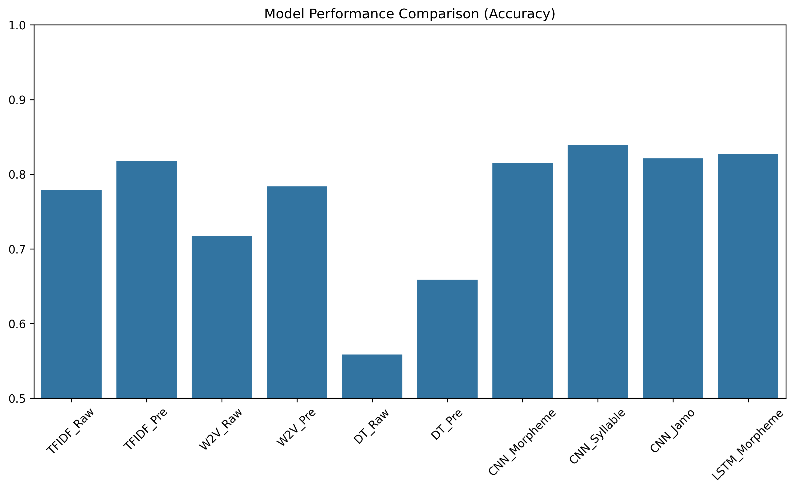
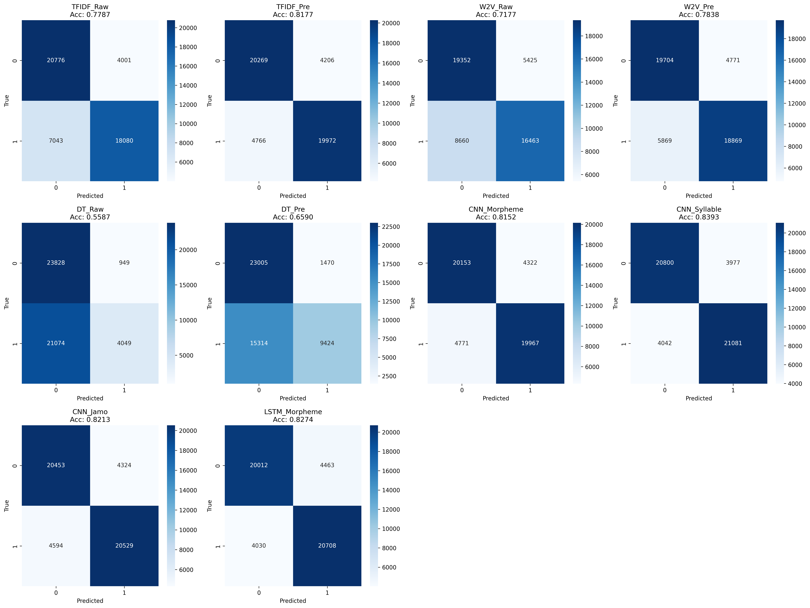

# AI+X: Deep Learning 2025-2
### AI+X: 딥러닝 2025-2 기말 프로젝트

-----

**정보시스템학과 2024062042 김규민 oplgk0576@hanyang.ac.kr**

**정보시스템학과 2023092606 송정빈 happysongjb@hanyang.ac.kr**

-----

## 한국어 영화 리뷰 데이터를 활용한 감성 분석: 성능 비교 및 개선 연구

## **Sentiment Analysis on Korean Movie Reviews: Performance Comparison and Improvement**

본 프로젝트는 **[NSMC (Naver Sentiment Movie Corpus)](https://github.com/e9t/nsmc)** 데이터셋을 활용하여 한국어 텍스트의 긍정/부정 감성을 분류하는 다양한 모델링 방법론을 비교 분석합니다. 고전적인 머신러닝 기법부터 딥러닝 모델까지 단계적으로 적용하며, 전처리 수준과 토큰화 단위가 모델 성능에 미치는 영향을 실증적으로 규명합니다.

본 문서는 **Google Colab** 환경에서 누구나 실험 결과를 재현할 수 있도록 작성되었습니다.

-----

## 목차

1. [프로젝트 개요](#1-프로젝트-개요)
2. [데이터셋 및 환경](#2-데이터셋-및-환경)
3. [방법론 및 실험 설계](#3-방법론-및-실험-설계)
    - [3.1. 통계 기반 머신러닝 (Baseline)](#31-통계-기반-머신러닝-baseline)
        - [3.1.1. TF-IDF 기반 모델링](#311-tf-idf-기반-모델링)
        - [3.1.2. Word2Vec 임베딩 모델링](#312-word2vec-임베딩-모델링)
        - [3.1.3. 결정 트리 (Decision Tree)](#313-결정-트리-decision-tree)
    - [3.2. 딥러닝 모델 (1D-CNN)](#32-딥러닝-모델-1d-cnn)
        - [3.2.1. Morpheme-level 1D-CNN (형태소 단위)](#321-morpheme-level-1d-cnn-형태소-단위)
        - [3.2.2. Syllable-level 1D-CNN (음절 단위)](#322-syllable-level-1d-cnn-음절-단위)
        - [3.2.3. Jamo-level 1D-CNN (자소 단위)](#323-jamo-level-1d-cnn-자소-단위)
    - [3.3. 딥러닝 모델 (LSTM)](#33-딥러닝-모델-lstm)
        - [3.3.1. Morpheme-level LSTM (형태소 단위)](#331-morpheme-level-lstm-형태소-단위)
4. [전처리 파이프라인 상세](#4-전처리-파이프라인-상세-preprocessing-strategy)
5. [최종 성능 평가 및 분석](#5-최종-성능-평가-및-분석)
    - [5.1. 예측 결과 저장](#51-예측-결과-저장)
    - [5.2. 성능 지표 계산 및 시각화](#52-성능-지표-계산-및-시각화)
6. [실험 결과](#6-실험-결과-experimental-results)
7. [결과 분석 및 고찰](#7-결과-분석-및-고찰-discussion)
8. [결론](#8-결론-conclusion)


-----


## 1\. 프로젝트 개요

감성 분석(Sentiment Analysis)은 텍스트에 내재된 주관적 의견을 식별하는 과제입니다. 한국어는 교착어 특성상 조사와 어미 처리가 중요하기 때문에, 이번 프로젝트에서는 다양한 방법론을 적용하여 여러 방식의 모델 구축과, **"전처리(Preprocessing)와 토큰화(Tokenization)가 성능에 미치는 영향"** 에 대한 고찰 또한 다루고자 합니다.

-----

## 2\. 데이터셋 및 환경

* **데이터셋:** **[NSMC (Naver Sentiment Movie Corpus)](https://github.com/e9t/nsmc)**
- **데이터 구조:** 각 파일은 `id`, `document`, `label`의 세 가지 컬럼으로 구성됩니다.
    - `id`: 네이버에서 제공하는 리뷰 ID
    - `document`: 실제 리뷰 텍스트
    - `label`: 리뷰의 감성 클래스 라벨 (0: 부정, 1: 긍정)
    - 각 컬럼은 탭(Tab)으로 구분됩니다 (`.tsv` 형식이지만 편의상 `.txt` 확장자 사용).
- **데이터 규모:** 총 200,000개의 리뷰
    - `ratings.txt`: 전체 200,000개 리뷰 통합본
    - `ratings_test.txt`: 테스트용으로 분리된 50,000개 리뷰
    - `ratings_train.txt`: 학습용 150,000개 리뷰
- **데이터 특징:**
    - 모든 리뷰는 140자 이내입니다.
    - 각 감성 클래스는 균등하게 추출되었습니다.
        - 부정 리뷰 100,000개 (기존 평점 1-4점)
        - 긍정 리뷰 100,000개 (기존 평점 9-10점)
        - 중립 리뷰(기존 평점 5-8점)는 제외되었습니다.

* **실험 환경 (Experimental Environment):**
  - **플랫폼:** Google Colab (GPU T4 런타임)
  - **Python 버전:** Python 3.12.12
  - **주요 라이브러리:** `scikit-learn`, `konlpy`, `gensim`, `jamo`, `torch`, `pandas`, `numpy`, `matplotlib`, `seaborn`, `tqdm`
  - **라이브러리 설치 방법:** 본 프로젝트는 단일 `.ipynb` 환경에서 수행할 예정입니다. 비교적 큰 데이터셋을 다루는 실험이기 때문에, KoNLPy의 Okt.morphs 대신 **Mecab** 형태소 분석기를 사용하며, 필요한 라이브러리 설치 코드는 아래와 같습니다.

  ```python
  # 1. Mecab 설치 (한국어 형태소 분석기)
  # C++ 기반으로, Java 기반의 KoNLPy 대비 매우 빠른 속도를 제공합니다.
  !pip install python-mecab-ko

  # 2. 공통 라이브러리 설치
  # jamo: 자소 분리 / gensim: Word2Vec / torch: 딥러닝
  !pip install jamo gensim torch scikit-learn pandas numpy matplotlib seaborn tqdm
  ```

-----

## 3\. 방법론 및 실험 설계

본 프로젝트는 전처리 수준과 모델의 복잡도가 성능에 미치는 영향을 다각도로 분석하기 위해 다음과 같이 실험군을 세분화하여 비교합니다.

### 3.1. 통계 기반 머신러닝 (Baseline)

가장 기본적인 모델인 로지스틱 회귀(Logistic Regression)와 결정 트리(Decision Tree)를 사용하여, **텍스트 전처리(형태소 분석 및 불용어 제거)의 유무**가 성능에 미치는 영향을 직접적으로 비교합니다.

#### 3.1.1. TF-IDF 기반 모델링
단어의 빈도를 가중치로 사용하는 TF-IDF 벡터화 방식을 사용합니다.
*   **Exp 1-1. TF-IDF (Raw):** 형태소 분석 없이 띄어쓰기(Whitespace) 기준으로 토큰화하며, 불용어 처리를 하지 않은 순수 데이터.
*   **Exp 1-2. TF-IDF (Preprocessed):** **`Mecab`** 분석기를 사용하여 조사/어미 등을 정교하게 분리하고 불용어를 제거한 데이터.
*   **[사용 라이브러리]**
    *   **전처리:** `mecab.MeCab` (Exp 1-2 only)
    *   **특성 추출:** `sklearn.feature_extraction.text.TfidfVectorizer`
    *   **모델:** `sklearn.linear_model.LogisticRegression`

#### 3.1.2. Word2Vec 임베딩 모델링
단어의 의미 정보를 반영하는 Word2Vec 임베딩을 적용한 후, 문장 내 단어 벡터들의 평균(Mean Pooling)값을 입력으로 사용합니다.
*   **Exp 2-1. Word2Vec (Raw):** 전처리 없는 띄어쓰기 기준 토큰의 임베딩 학습.
*   **Exp 2-2. Word2Vec (Preprocessed):** 형태소 분절 및 불용어 제거를 수행한 토큰의 임베딩 학습.
*   **[사용 라이브러리]**
    *   **전처리:** `mecab.MeCab` (Exp 2-2 only)
    *   **임베딩:** `gensim.models.Word2Vec`
    *   **연산:** `numpy` (평균 풀링 / Mean Pooling)
    *   **모델:** `sklearn.linear_model.LogisticRegression`

#### 3.1.3. 결정 트리 (Decision Tree)
희소(Sparse)한 텍스트 데이터에서 트리 모델이 갖는 한계를 확인하고, 전처리가 트리의 복잡도 완화에 미치는 영향을 확인합니다.
*   **Exp 3-1. Decision Tree (Raw):** 전처리 없는 고차원 데이터 학습.
*   **Exp 3-2. Decision Tree (Preprocessed):** 핵심 형태소만 남긴 데이터 학습.
*   **[사용 라이브러리]**
    *   **전처리:** `mecab.MeCab` (Exp 3-2 only)
    *   **특성 추출:** `sklearn.feature_extraction.text.TfidfVectorizer`
    *   **모델:** `sklearn.tree.DecisionTreeClassifier`

### 3.2. 딥러닝 모델 (1D-CNN)

딥러닝 모델에서는 **"입력 토큰 단위"** 를 핵심 변수로 설정하여, 한국어의 언어적 특성에 가장 적합한 표현 방식을 탐구합니다. CNN 모델은 `PyTorch`를 사용하여 구현하며, 동일한 아키텍처(Kernel sizes, Filters )를 공유합니다.

#### 3.2.1. Morpheme-level 1D-CNN (형태소 단위)
*   **특징:** 의미의 최소 단위인 형태소를 입력으로 사용합니다. 문법적 구조를 가장 잘 반영하는 정석적인 방법입니다.
*   **입력:** `Mecab`을 통해 분절된 형태소 시퀀스.
*   **[사용 라이브러리]**
    *   **전처리:** `mecab.MeCab`
    *   **모델:** `torch.nn` (임베딩, Conv1d, 선형 레이어)
    *   **최적화:** `torch.optim`

#### 3.2.2. Syllable-level 1D-CNN (음절 단위)
*   **특징:** '글자(Character)' 단위로 문장을 쪼개어 입력합니다. OOV(미등록 단어 / Out of Vocabulary) 문제가 거의 발생하지 않으며, 오탈자에 비교적 강건할 것으로 예상됩니다.
*   **입력:** 한국어 음절 시퀀스 (예: "영화" -> "영", "화")
*   **[사용 라이브러리]**
    *   **전처리:** Python 기본 문자열 처리 (슬라이싱)
    *   **모델:** `torch.nn` (임베딩, Conv1d, 선형 레이어)
    *   **최적화:** `torch.optim`

#### 3.2.3. Jamo-level 1D-CNN (자소 단위)
*   **특징:** 한글의 자모(초성, 중성, 종성)를 분리하여 입력합니다. 음절보다 더 작은 단위의 패턴을 학습하여, 신조어나 비표준어(초성체 등)가 많은 리뷰 데이터에서 잠재력을 가질것을 예상할 수 있습니다.
*   **입력:** `jamo` 라이브러리의 `j2hcj` 함수를 활용한 자소 시퀀스 (예: "영화" -> "ㅇ", "ㅕ", "ㅇ", "ㅎ", "ㅘ")
*   **[사용 라이브러리]**
    *   **전처리:** `jamo.h2j`, `jamo.j2hcj`
    *   **모델:** `torch.nn` (임베딩, Conv1d, 선형 레이어)
    *   **최적화:** `torch.optim`

### 3.3. 딥러닝 모델 (LSTM)

순차 데이터(Sequential Data) 처리에 특화된 RNN 계열의 LSTM을 사용하여, 문맥의 장기 의존성(Long-term Dependency)을 학습합니다. CNN이 지역적 특징(Local Feature) 추출에 강하다면, LSTM은 문장 전체의 흐름을 파악하는 데 강점이 있습니다.

#### 3.3.1. Morpheme-level LSTM (형태소 단위)
*   **특징:** 3.2.1의 CNN 모델과 동일한 '형태소 전처리 데이터'를 사용하여, 아키텍처(CNN vs LSTM)에 따른 성능 차이를 공정하게 비교합니다. 정교한 형태소 분절과 불용어 제거를 통해 핵심 의미 단위의 시퀀스를 학습합니다.
*   **입력:** `Mecab`을 통해 분절된 형태소 시퀀스.
*   **[사용 라이브러리]**
    *   **전처리:** `mecab.MeCab`
    *   **모델:** `torch.nn` (임베딩, LSTM, 선형 레이어, 드롭아웃)
    *   **시퀀스 처리:** `torch.nn.utils.rnn` (`pad_sequence`, `pack_padded_sequence`, `pad_packed_sequence`)
        *   *참고: 가변 길이 시퀀스의 효율적 학습을 위해 패딩(Padding) 및 패킹(Packing) 기법을 적용합니다.*
    *   **최적화:** `torch.optim`


-----

## 4\. 전처리 파이프라인 상세 (Preprocessing Strategy)

본 연구는 모델과 실험 목적에 따라 총 3가지의 상이한 전처리 파이프라인을 적용합니다.

### 파이프라인 A: 최소 전처리 (Raw 데이터)
> **적용 대상:** Exp 1-1, 2-1, 3-1 (Raw 비교군) 및 3.2.2 (Syllable CNN)
*   가장 기초적인 정제만 수행하여 데이터 본연의 노이즈를 보존합니다.
1.  **Data Cleaning:** 결측치(Null) 및 중복 데이터 제거.
2.  **Regex Cleaning:** 한글, 영어, 숫자, 공백을 제외한 특수문자 제거 (`[^ㄱ-ㅎ가-힣0-9a-zA-Z ]`).
3.  **Tokenization:** 공백(띄어쓰기) 기준 분절 (Syllable CNN의 경우 음절 단위로 분절).

### 파이프라인 B: 언어학적 전처리 (형태소 분석)
> **적용 대상:** Exp 1-2, 2-2, 3-2 (Preprocessed 비교군) 및 **3.2.1 (Morpheme CNN), 3.3.1 (Morpheme LSTM)**
*   한국어 문법 지식을 활용하여 의미 단위로 데이터를 압축합니다.
1.  **Basic Cleaning:** 파이프라인 A와 동일 (결측치 및 특수문자 제거).
2.  **형태소 분석:** **`Mecab` (python-mecab-ko)** 사용.
    *   **형태소 단위 분절:** 문장을 형태소 단위로 정밀하게 분해 (예: '재밌었다' -> '재밌', '었', '다').
    *   *Note: Okt와 달리 인위적인 원형 복원(Stemming)을 수행하지 않고, 형태소 본연의 의미를 보존하여 학습에 활용함.*
3.  **불용어 제거:** 조사, 접속사 등 의미 기여도가 낮은 불용어 리스트 정의 및 제거.
4.  **필터링:** 길이가 1 이하인 토큰 제거.

### 파이프라인 C: Sub-character 전처리 (자모 단위)
> **적용 대상:** 3.2.3 (Jamo CNN)
*   한글의 구성 원리를 활용하여, 자모 단위로 데이터를 분해합니다.
1.  **Basic Cleaning:** Pipeline A와 동일.
2.  **자모 분리:** `jamo` 패키지 활용.
    *   `h2j()`: 한글 음절을 초/중/종성으로 분리합니다 (조합형 자모).
    *   `j2hcj()`: 분리된 자모를 '한글 호환 자모'로 변환하여 학습 가능한 시퀀스로 생성합니다.
    *   실제 작업에서는 `j2hcj(h2j("한글텍스트"))` 의 형태로 조합하여 사용할 예정입니다.

### 데이터 효율성을 위한 절차 (Pickle 캐싱)
실험 도중 일어날 수 있는 Google Colab의 런타임 초기화 문제에 대응하고 실험 효율성을 높이기 위해, 각 파이프라인을 거친 데이터는 **`pickle`** 형식으로 로컬에 캐싱(Caching)합니다.
*   **목적:** 형태소 분석(파이프라인 B) 및 자모 분리(파이프라인 C) 과정을 매 실험마다 반복하지 않고, 저장된 리스트 객체를 즉시 로드하여 학습 시간을 단축합니다.
*   **파일 포맷:** `train_morphs.pkl`, `train_jamo.pkl` 등.

-----

## 5\. 최종 성능 평가 및 분석

모든 모델의 학습이 완료된 후, 테스트용 데이터(50,000개)에 대한 객관적인 성능 비교를 위해 통일된 평가 프로세스를 진행합니다.

### 5.1. 예측 결과 저장
각 모델(3.1 ~ 3.3)로 테스트 데이터셋에 대한 추론을 수행하고, 예측된 라벨(0 또는 1)을 텍스트 파일로 저장합니다. 이를 통해 실험 코드를 다시 돌리지 않고도 결과를 영구적으로 보존하고 분석할 수 있습니다.
*   **Output Format:** `prediction_[ModelName].txt` (각 행에 0 또는 1 기록)
*   **[사용 라이브러리]**
    *   `torch` (Inference mode: `with torch.no_grad():`)
    *   `sklearn` (Model `predict` method for ML models)
    *   `numpy` (Array handling)

### 5.2. 성능 지표 계산 및 시각화
저장된 예측 파일들과 정답 라벨(`ratings_test.txt`)을 로드하여 최종 성능을 계산합니다. 단순 정확도(Accuracy)뿐만 아니라, 모델이 어떤 클래스를 헷갈려하는지 파악하기 위해 혼동 행렬(Confusion Matrix)을 시각화합니다.
1.  **정확도 계산:** 전체 테스트 데이터 중 올바르게 분류한 비율 계산.
2.  **혼동 행렬(Confusion Matrix):** True Positive, True Negative, False Positive, False Negative 분포 확인.
*   **[사용 라이브러리]**
    *   **Metrics:** `sklearn.metrics.accuracy_score`, `sklearn.metrics.confusion_matrix`
    *   **데이터 처리:** `pandas` (결과 집계), `numpy`
    *   **시각화:** `matplotlib.pyplot`, `seaborn` (히트맵 시각화)

-----

## 6\. 실험 결과 (Experimental Results)

총 10가지의 실험군에 대하여 테스트 데이터(50,000개)를 기반으로 측정한 정확도(Accuracy) 순위는 다음과 같습니다. 딥러닝 모델과 통계 기반 모델, 그리고 전처리 유무에 따라 성능 차이가 뚜렷하게 나타났습니다.

| Rank | Model Name | Accuracy | Category | Input Unit |
| :--- | :--- | :--- | :--- | :--- |
| **1** | **CNN_Syllable** | **0.8393** | **Deep Learning** | **음절 (Character)** |
| 2 | LSTM_Morpheme | 0.8274 | Deep Learning | 형태소 (Morpheme) |
| 3 | CNN_Jamo | 0.8213 | Deep Learning | 자소 (Jamo) |
| 4 | TFIDF_Pre | 0.8177 | Machine Learning | 형태소 (Morpheme) |
| 5 | CNN_Morpheme | 0.8152 | Deep Learning | 형태소 (Morpheme) |
| 6 | W2V_Pre | 0.7838 | Machine Learning | 형태소 (Morpheme) |
| 7 | TFIDF_Raw | 0.7787 | Machine Learning | 어절 (Raw) |
| 8 | W2V_Raw | 0.7177 | Machine Learning | 어절 (Raw) |
| 9 | DT_Pre | 0.6590 | Machine Learning | 형태소 (Morpheme) |
| 10 | DT_Raw | 0.5587 | Machine Learning | 어절 (Raw) |

### 성능 비교 그래프


### 혼동 행렬 (Confusion Matrix) 시각화
상위 모델들은 긍정(1)과 부정(0)을 균형 있게 예측한 반면, 하위 모델(특히 Decision Tree Raw)은 특정 클래스로 예측이 편향되는 경향을 보였습니다.



*(실험 코드 실행 시 `model_accuracy_comparison.png` 및 `confusion_matrices.png` 파일이 생성됩니다.)*

-----

## 7\. 결과 분석 및 고찰 (Discussion)

실험 결과를 바탕으로 전처리의 영향과 모델 아키텍처의 특성을 다음과 같이 분석하였습니다.

### 7.1. 전처리 수준이 성능에 미치는 영향
*   **머신러닝(ML)에서의 형태소 분석 필수성:** `TF-IDF`, `Word2Vec`, `Decision Tree` 등 모든 통계 기반 모델에서 형태소 분석을 적용한 경우(Pre)가 원본(Raw) 데이터보다 월등히 높은 성능을 보였습니다. 교착어인 한국어 특성상, 조사와 어미를 분리하지 않으면 단어의 의미를 제대로 포착하기 어렵다는 점이 재확인되었습니다.
*   **딥러닝(DL)에서의 음절 단위 재발견:** 본 실험의 가장 흥미로운 결과는 **`CNN_Syllable` (83.93%)** 이 형태소 기반 모델들을 제치고 1위를 차지했다는 점입니다.
    *   **강건함(Robustness):** 영화 리뷰 데이터 특성상 오탈자, 신조어, 띄어쓰기 오류가 빈번합니다. 음절 단위 모델은 이러한 노이즈에 영향을 덜 받으며, OOV(Out-Of-Vocabulary) 문제로부터 자유롭습니다.
    *   **효율성:** 형태소 분석기의 오분석 가능성을 배제하고, 글자 자체의 패턴을 학습하는 것이 파라미터가 제한된 소형 모델에서는 더 효율적이었던 것으로 판단됩니다.

### 7.2. 모델 아키텍처 비교 (CNN vs LSTM vs Baseline)
*   **CNN vs LSTM:** 동일한 형태소 입력을 사용했을 때, `LSTM_Morpheme`(82.74%)이 `CNN_Morpheme`(81.52%)보다 소폭 우수한 성능을 보였습니다. 이는 문맥의 순차적 정보와 장기 의존성을 파악하는 데 LSTM이 더 유리함을 시사합니다. 하지만 연산 속도와 자소/음절 단위 적용의 유연성 측면에서는 CNN이 강점을 보였습니다.
*   **Baseline의 저력:** 단순한 선형 모델인 `TFIDF_Pre`(81.77%)가 딥러닝 모델인 `CNN_Morpheme`와 대등한 성능을 기록했습니다. 이는 감성 분석 태스크에서 특정 긍/부정 단어(Keyword)의 등장이 매우 강력한 특징(Feature)으로 작용함을 의미합니다.
*   **결정 트리의 한계:** `DT_Raw`(55.87%)는 거의 무작위 추측에 가까운 성능을 보였습니다. 고차원의 희소한 텍스트 데이터를 단일 결정 트리로 학습하는 것은 과적합 위험이 크고 표현력이 부족함을 확인했습니다.

### 7.3. 자소(Jamo) 단위의 잠재력
`CNN_Jamo`(82.13%) 모델 역시 상위권에 위치했습니다. 이는 초성체(예: 'ㅎㅎ', 'ㅋㅋ')나 변형된 자모 표현이 많은 인터넷 구어체 텍스트에서 자소 단위 분해가 유의미한 특징을 추출할 수 있음을 보여줍니다.

-----

## 8\. 결론 (Conclusion)

본 프로젝트는 한국어 영화 리뷰 데이터셋(NSMC)을 활용하여 전처리 수준과 모델링 기법에 따른 감성 분석 성능을 종합적으로 비교하였습니다. 연구의 주요 결론은 다음과 같습니다.

1.  **최적의 방법론:** 제한된 리소스와 오타가 많은 구어체 텍스트 환경에서는 **음절(Syllable) 단위의 1D-CNN**이 복잡한 전처리 없이도 가장 우수한 성능을 발휘했습니다.
2.  **전처리의 중요성:** 딥러닝이 아닌 전통적 머신러닝 기법을 사용할 경우, **형태소 분석**은 선택이 아닌 필수적인 과정임을 입증했습니다.
3.  **향후 연구 방향:** 본 실험에서는 학습 속도를 위해 모델의 크기(Embedding Dimension 등)를 작게 설정했습니다. 향후 모델의 크기를 키우거나 Transformer(BERT 등) 기반의 사전 학습 모델을 도입한다면, 형태소 및 문맥 기반 모델의 성능이 더욱 향상될 여지가 있습니다.

이상의 연구 결과는 한국어 텍스트 분석 시 데이터의 특성(정제 여부, 구어체 등)에 따라 적절한 토큰화 단위와 모델을 선택하는 것이 중요함을 시사합니다.
